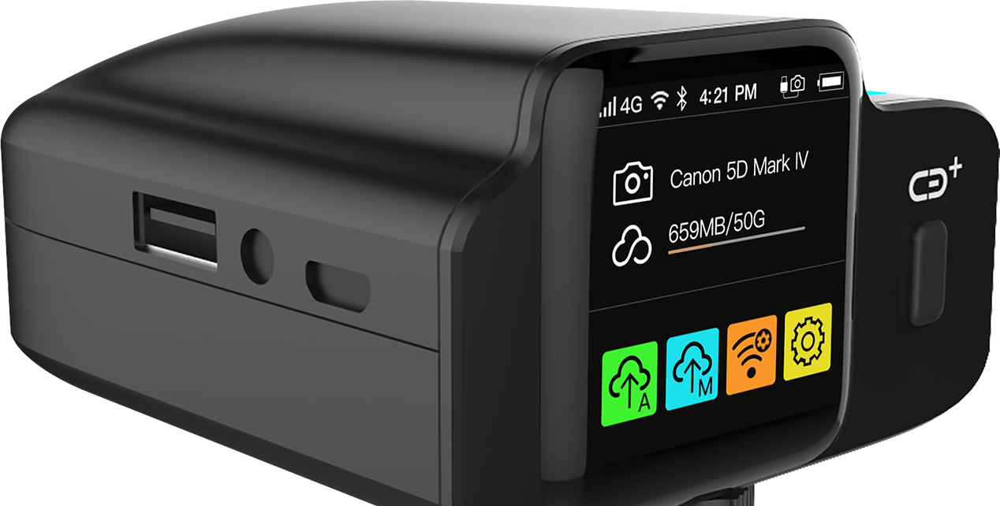

# 合璧操作系统设备侧的软件架构

魏永明

在我们发布了 hiWebKit 之后，飞漫的研发团队立即开始着手构建合璧操作系统（HybridOS）设备侧的应用运行环境。本文将为大家介绍合璧操作系统设备侧的软件架构及主要特性。

## 软件架构

随着物联网的发展，诸如工业控制面板、家用电器、智能门锁、智能音箱等产品开始配置了触摸屏，用户对人机交互的要求越来越高。

这类目标设备通常具有如下的特征：

1. 具有较大的屏幕尺寸，通常横屏显示。
1. 无实体按键或只有单个实体按键，用户使用触摸屏操作。
1. 基本的多任务切换能力。
1. 一定的系统设置功能，如获取 WiFi 列表，连接指定 WiFi 设备等。
1. 需要提供固件升级功能。

当下，当我们使用 Linux+MiniGUI/Qt 或者 RTOS+MiniGUI 等软件方案开发此类设备时，遇到的最大的问题就是 C/C++ 开发人员难觅，开发门槛告，开发周期长等。而使用合璧操作系统为设备侧提供的全新软件栈，此类问题将不复存在。合璧操作系统设备侧将为这类设备的开发提供最先进的支持：

1. 开发者可基于 hiWebKit 的扩展标签和功能，结合 HTML 5/CSS 3/JavaScript 开发具有丰富交互效果和优秀展示能力的图形用户界面。
1. 如果产品的硬件成本要求更高，我们甚至可以禁止 hiWebKit 中的 JavaScript 支持，借助 hiWebKit 中的页面动态更新能力，可以可以以更小的存储空间和运行内存获得一样的效果。

下图给出了合璧操作系统设备侧的软件架构。


```
 ---------------------------------------------------------------------------------
| DockerBar, StatusBar,   |                   |           | Input Method Window,  |
| Screen Lock, Launcher,  | App Main Windows  |  N/A      | System Alert Window,  |        - main windows
| Notification...         |                   |           | ...                   |
 ---------------------------------------------------------------------------------
|      System Manager     |     App Agent     | Wallpaper | mginit w/ compositor  |____    - processes
 ---------------------------------------------------------------------------------     |
|                   hiWebKit                  |                                   |    |
 ---------------------------------------------                                    |    |
|  MiniGUI, hiCairo, hiMesa, SQLite, FreeType, HarfBuzz, LibPNG, LibJPEG, ...     |    | hiBus/WebSocket
|                                                                                 |    |
 ---------------------------------------------------------------------------------     |
|                HybridOS servers (hiBus, hiWSServer, ...)                        |____|
 ---------------------------------------------------------------------------------     |
|                          User Daemons (Python or C/C++)                         |____|
 ---------------------------------------------------------------------------------
|                          Python runtime environment (optional)                  |
|                             LibZ, CURL, LibGcrypt, ...                          |
|                               C/C++ runtime environment                         |
 ---------------------------------------------------------------------------------
|                               Linux Kernel/Drivers                              |
 ---------------------------------------------------------------------------------
```
在合璧操作系统设备侧，我们使用 MiniGUI 5.0（多进程模式）作为窗口系统，为尽量少占用系统资源，状态栏、任务栏等系统界面仍使用 C/C++ 开发，而所有的应用基于 hiWebKit 来渲染其界面。在人机交互层面，一共运行着四个进程：

1. MiniGUI 的 `mginit`。该进程扮演窗口管理器运行，使用 C/C++ 开发，包括如下模块：
   1. 定制的合成器（compositor），用于提供应用主窗口启动、关闭时，以及切换主窗口时的动画特效。
   1. 可选的输入法支持。
1. 动态壁纸。该进程展示动态壁纸。
1. 系统管理进程，拥有较高的系统管理权限，该进程负责创建应用子进程，并创建和维护如下主窗口（称为系统主窗口，system main window）：
   1. 任务栏（Docker Bar），用于呼出主功能（或启动器）、系统设置，选择和切换应用主窗口等。
   1. 状态栏（Status Bar），用于展示当前活动主窗口的标题（及图标）、时间以及系统电量等信息。
   1. 锁屏（HybridOS Screen Lock），在 hiWebKit 支持下运行，从而可使用 HTML/CSS/JavaScript 开发。
   1. 启动器（HybridOS Launcher），在 hiWebKit 支持下运行，从而可使用 HTML/CSS/JavaScript 开发。
   1. 通知（HybridOS Notification），在 hiWebKit 支持下运行，从而可使用 HTML/CSS/JavaScript 开发。
1. 应用进程，在 hiWebKit 的支持下运行，使用扩展的 Web 前端技术开发：
   1. 应用进程创建的主窗口称为应用主窗口（app main window）；所有应用主窗口由单个 hiWebKit 进程实例管理，属于同一进程地址空间。
   1. 同一时刻只有一个前台应用主窗口展示在屏幕上（全屏），其他后台的应用主窗口对应的页面，进入节约内存状态。
   1. 后台应用主窗口被唤醒后，恢复页面状态，原来的前台主窗口称为后台应用主窗口，进入节约内存状态。

与应用配合，系统中有若干服务器或者守护进程在运行：

1. hiBus 本地总线服务器。通过该服务器，我们可以在应用中获得系统状态的变化信息（如电量、WiFi 信号强度等），还可以通过发送任务请求来完成某些系统功能，如连接到指定的 WiFi 热点。在使用 hiWebKit 扩展标签的情形下，我们利用 hiBus 提供的服务完成页面的自动更新，而无需 JavaScript 的支持。
1. 本地 WebSocket 服务器（hiWSServer）。该服务运行在本地，为基于 hiWebKit 的页面提供 WebSocket 服务，本质上作为 hiBus 服务器的代理进行运行，从而无需开发 JavaScript 的本地绑定对象，即可实现对系统功能的调用。
1. 真正完成具体功能的任务，通常被设计为守护进程，可使用 Python 脚本或者 C/C++ 程序来开发。这些守护进程连接到 hiBus 上，获取来自应用的任务请求，执行对应的请求并返回相应的数据，或者主动发送系统通知给需要的应用。

我们如此设计合璧操作系统设备侧的软件架构，主要出于如下几点考虑：

1. 将人机交互界面和具体功能的实现完全隔离开来，最大程度解耦数据和交互。
1. 利用简单的机制将系统中不同的模块连接起来。
1. 使用最高效的开发工具开发系统中不同的功能模块，比如 GUI，使用扩展的 HTML/CSS/JavaScript Web 前端技术，而真正实现设备功能的模块，用 C/C++ 或者 Python。

其实，这一架构思路已经在飞漫软件曾经开发的一款智能硬件产品（CBPlus）中得到了的应用。



## 交付计划


（待续）

