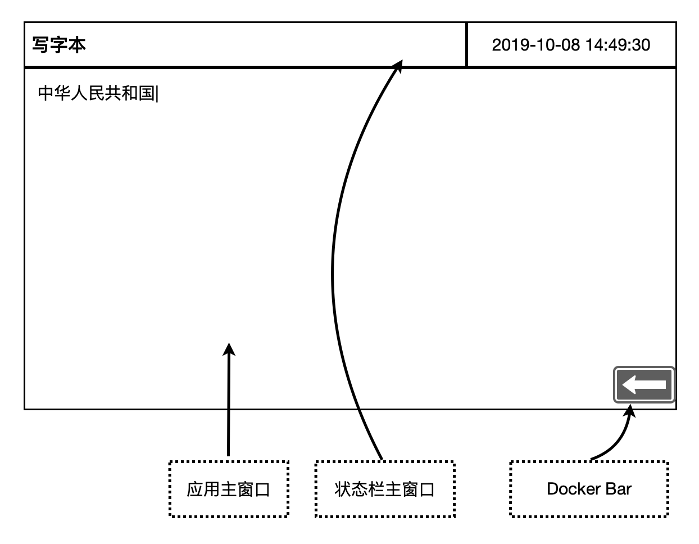
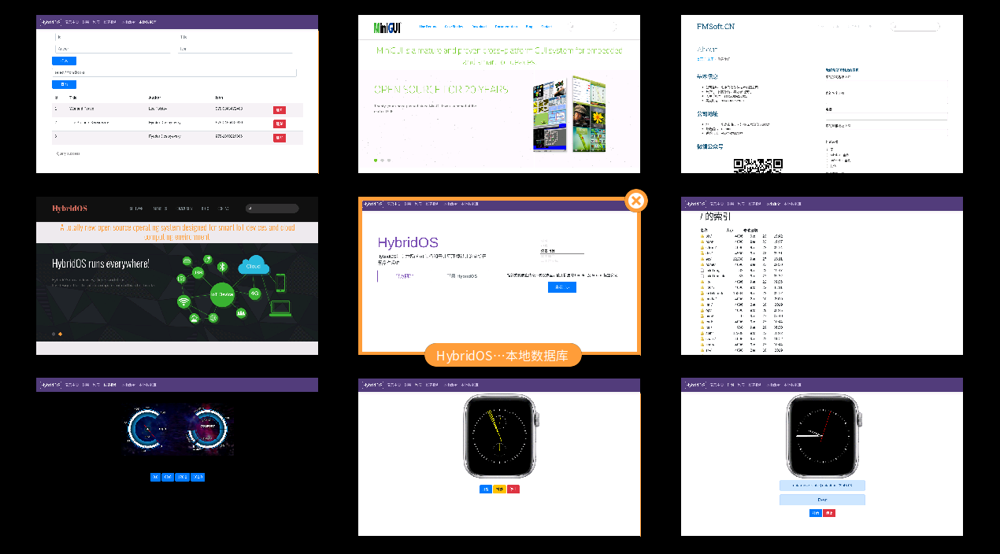

# 合璧操作系统设备端界面外壳的设计

魏永明

本文阐述合璧操作系统设备端界面外壳的设计。

## 单一应用场景

工业控制面板、家用电器的智能控制面板等属于本文所述的单一应用场景。这种应用场景通常具有如下几个特点：

1. 具有较大的屏幕尺寸，通常为横屏。
1. 无图形硬件加速，不需要多媒体支持。
1. 无实体按键，用户使用触摸屏操作，常见操作主要是点击和单指拖拽。
1. 除了输入 WiFi 密码等情形外，极少需要输入法来输入一般文字等。
1. 基本的多任务切换能力。
1. 无需支持第三方应用的下载和安装。
1. 需要提供固件升级功能。

在合璧操作系统中，使用 MiniGUI 5.0（多进程模式）作为窗口系统，而所有的应用使用 hiWebKit 来渲染其界面。在 GUI 层面，一共有三个进程：

1. MiniGUI 的 `mginit`。该进程扮演窗口管理器运行，使用 C/C++ 开发，包括如下模块：
   1. 定制的合成器（compositor），用于提供主窗口启动、关闭和主窗口展示及前后台切换的特效。
   1. 一个用作 Docker 的主窗口，用于呼出主功能、启动器或系统设置，展示应用主窗口，切换应用主窗口等。
   1. （可选）输入法。
1. 系统管理进程，拥有较高的系统管理权限，在 hiWebKit 的支持下运行，使用扩展的 Web 前端技术开发，可创建如下主窗口（称为系统主窗口，system main window）：
   1. 启动器（HybridOS Launcher）。
   1. 状态栏（HybridOS Status Bar）。
   1. 通知（HybridOS Notification）。
   1. 锁屏（HybridOS Screen Lock）。
   1. 系统设置（HybridOS System Settings）。
1. 应用进程，在 hiWebKit 的支持下运行，使用扩展的 Web 前端技术开发：
   1. 应用进程创建的主窗口称为应用主窗口（app main window）；所有应用主窗口由单个 hiWebKit 进程实例管理，属于同一进程地址空间。
   1. 同一时刻只有一个前台应用主窗口展示在屏幕上（全屏），其他后台的应用主窗口对应的页面，进入节约内存状态。
   1. 后台应用主窗口被唤醒后，恢复页面状态，原来的前台主窗口称为后台应用主窗口，进入节约内存状态。

下图给出了单一应用场景下的系统架构图：

```
 ------------------------------------------------------------------------------
|  System Main Windows    | App Main Windows  | Docker, Input Method Window    |
 ------------------------------------------------------------------------------
|    System Manager       |    App Process    | mginit w/ tailored compositor  |____
 ------------------------------------------------------------------------------     |
|                   hiWebKit                  |                                |    |
 ---------------------------------------------                                 |    |
|  MiniGUI, hiCairo, hiMesa, SQLite, FreeType, HarfBuzz, LibPNG, LibJPEG, ...  |    | hiBus
|                          C/C++ runtime env.                                  |    |
 ------------------------------------------------------------------------------     |
|                       HybridOS daemons/servers                               |____|
 ------------------------------------------------------------------------------
|          LibZ, CURL, LibGcrypt,  C/C++ standard libraries                    |
 ------------------------------------------------------------------------------
|                               Linux Kernel/Drivers                           |
 ------------------------------------------------------------------------------
```

下图给出了正常运行情况下的界面效果：



下图给出了进入切换应用主窗口模式下的界面效果：



### 第一阶段完成

以上设计可分阶段完成。第一阶段主要包括：

1. mginit
   - docker 主窗口
   - 支持应用主窗口切换动画效果的合成器
1. 系统管理器：
   - 仅显示时间的状态栏
   - 一个简单的锁屏页面
   - 一个简单的系统设置页面
1. 应用进程：
   - 功能入口页面
   - 若干 hiWebKit 特色功能展示页面
   - 一般性网站

### 还需要完善的功能

根据以上描述，我们还需要完成如下功能特性：

1. 通过 hiBus 和系统守护进程、服务器交换数据，并动态更新页面内容。
1. 应用主窗口进入节约内存状态以及恢复正常状态。
1. 基本的进程特权管理，用于系统管理器。

## 复杂应用场景

（待续）

---

更多合璧操作系统的技术突破，请关注后续文章。

