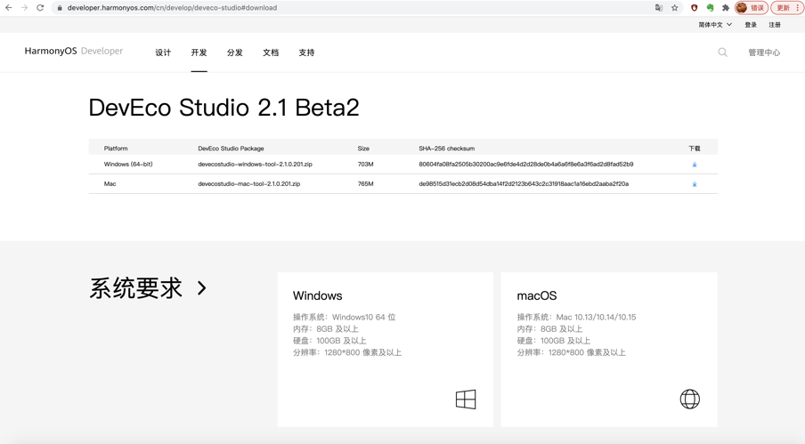
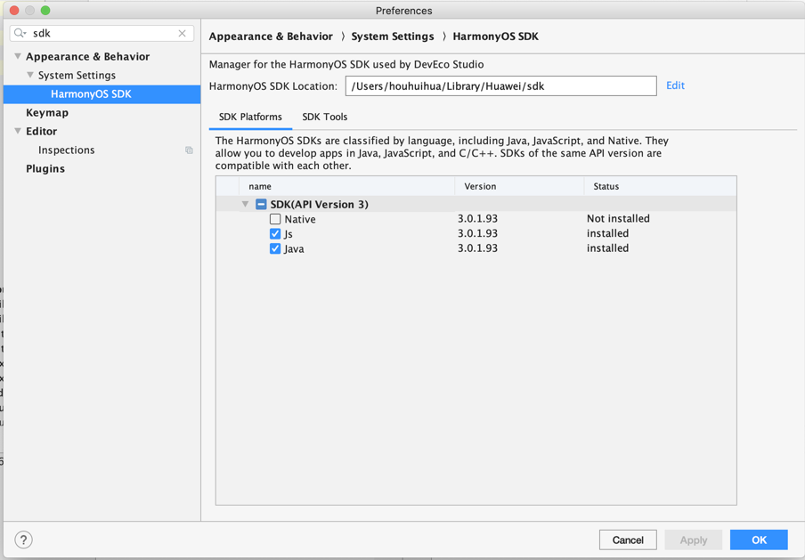
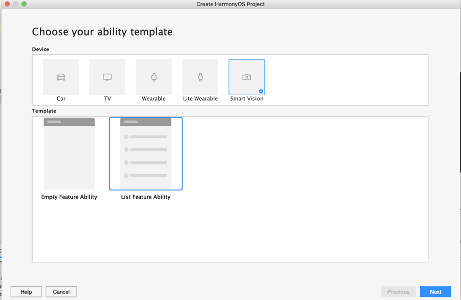
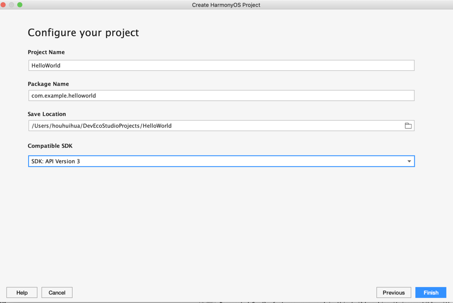
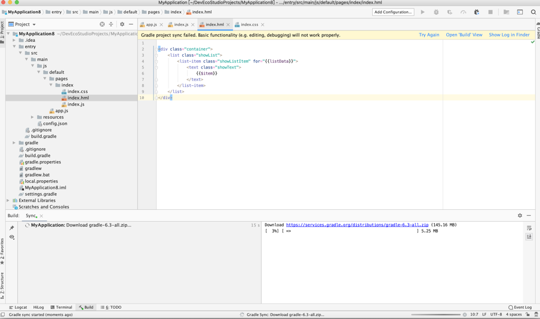

# 基于 hiACEJS 在 MiniGUI 上进行类小程序应用开发

【主题】基于 hiACEJS 在 MiniGUI 上进行类小程序应用开发  
【概要】本文阐述基于 hiACEJS 在 MiniGUI 上进行类小程序应用开发  
【版本】1.0  
【作者】薛淑明  
【日期】2021 年 02 月  
【状态】草稿  

**版权声明**

版权所有 &copy; 2020 北京飞漫软件技术有限公司  
保留所有权利

此文档不受合璧操作系统相关软件开源许可证的管辖。

飞漫软件公开此文档的目标，用于向开发者解释合璧操作系统的设计原理或者相关规范。在未获得飞漫软件书面许可之前，任何人不得复制或者分发本文档的全部或部分内容，或利用本文档描绘的技术思路申请专利、撰写学术论文等。

本文涉及到的飞漫软件或其合作伙伴的注册商标或商标，有关其详细列表，请查阅文档末尾。

**目录**

- [基本概念及术语](#基本概念及术语)
- [使用 DevEco Studio 开发 ACELite 应用](#使用-deveco-studio-开发-acelite-应用)
  + [DevEco Studio 开发环境的安装与配置](#deveco-studio-开发环境的安装与配置)
     * [下载 DevEco Studio](#下载-deveco-studio)
     * [安装配置 DevEco Studio](#安装配置-deveco-studio)
  + [使用 DevEco Studio 创建应用程序](#使用-deveco-studio-创建应用程序)
     * [创建工程](#创建工程)
     * [编写代码](#编写代码)
- [ACELite 应用通过 hiBus 访问系统功能](#acelite应用通过-hibus-访问系统功能)
  + [Hello, world!](#hello-world)
     * [导入模块](#导入模块)
     * [建立链接](#建立链接)
     * [关闭链接](#关闭链接)
     * [订阅事件](#订阅事件)
     * [取消事件订阅](#取消事件订阅)
     * [调用过程](#调用过程)
  + [hibus-wrapper](#hibus-wrapper)
  + [hibus-simulator](#hibus-simulator)
  + [Buildroot rpi4](#buildroot-rpi4)
- [附：商标声明](#附商标声明)


## 基本概念及术语

hiACEJS 是 OpenHarmony ACELite JS 框架在合璧操作系统中基于MiniGUI的实现。兼容了 OpenHarmony ACELite JS 的API，使用纯JS 开发的 OpenHarmony ACELite 应用可以不用修改直接在 hiACEJS 上运行。

DevEco Studio 是用于开发 OpenHarmony ACELite 的集成开发环境，在本文中，主要为开发者提供一个比较友好的代码编写环境。

hiBus是合璧操作系统设备端数据总线。在合璧操作系统中，hiBus 是成为 HybridOS 连接 App 和底层功能模块的纽带。在本文中，hiBus 主要为 hiACEJS 应用提供了访问系统功能的能力。


## 使用 DevEco Studio 开发 ACELite 应用

DevEco Studio 是基于 IntelliJ IDEA Community 开源版本打造，面向终端全场景多设备的一站式集成开发环境，为开发者提供从工程模板创建、代码开发、编译、调试、测试等 OpenHarmony 应用开发服务。支持Java、JS、C/C++开发语言。

DevEco Studio具有以下特色能力：融合UX设计，分布式多端开发，分布式多端调测，多端模拟仿真，全方位质量保障，纯净安全等。

### DevEco Studio 开发环境的安装与配置

#### 下载 DevEco Studio

访问 HarmonyOS 应用开发官方网站[下载](https://developer.harmonyos.com/cn/develop/deveco-studio)
DevEco Studio。需要注意的是下载 DevEco Studio 需要使用华为开发者帐号进行登录，登录成功后才能下载。

目前，DevEco Studio 支持Windows （64-bit) 和 Mac 两个平台，其中 Windows 是最先支持的平台，功能相对完善, 目前最新版本是 2.1 Beta2, 系统要求如下图:




#### 安装配置 DevEco Studio

DevEco Studio 的安装比较简单，以 Windows 版本为例，基本上一路 Next 即可。需要注意的是设置安装路径和是否创建桌面快捷方式。安装完成后，先暂时不启动DevEco Studio。

使用 DevEco Studio 开发 OpenHarmony ACELite 应用还需要 Node.js 的支持。Node.js 的下载安装请参考 Node.js 的[官方网站](https://nodejs.org/)。

Node.js安装完成后，启动 DevEco Studio，我们需要为 OpenHarmony 应用的开发安装配置 SDK，方法如下：

打开 Preference -> 搜索 "sdk" 将会找到 SDK 安装配置界面，如下图:



更多有关工具的下载与安装，可以参考 HarmonyOS

[官方网站](https://developer.harmonyos.com/cn/docs/documentation/doc-guides/installation_process-0000001071425528)。


### 使用 DevEco Studio 创建应用程序

掌握 DevEco Studio 集成开发环境的最好方法就是使用它，下面以创建一个显示"Hello World"字符串的简单的应用程序为例来展示 DevEco Studio 的用法。

#### 创建工程

启动 DevEco Studio，在欢迎页点击 Create HarmonyOS Project，创建一个"Hello World"新工程。选择设备类型和模板，点击 "Smart Vision"，选择 List Feature Ability，点击Next。




配置工程的基本信息，如下图:



点击 Finish，完成工程创建。DevEco Studio会自动进行工程的同步，同步成功如下图所示。首次创建工程时，会自动下载Gradle工具, 这个时间会有点长。




#### 编写代码

Hello World 工程创建成功后如上图所示，主要有以下三个文件:

* index.css CSS样式文件
  - 为了模块化管理和代码复用，CSS样式文件支持 @import 语句，导入 CSS 文件
  - 当多条选择器声明匹配到同一元素时，各类选择器优先级由高到低顺序为： 内联样式 > id > class > tag

```css
.container {
    justify-content: center;
    align-items: center;
}
.title {
    width: 320px;
    height: 100px;
    font-size: 50px;
    text-align: center;
}
```

* index.html UI 布局文件,  可以进行动态的数据绑定，当数据发生变化时，自动更新相关UI 及逻辑
  - 样式文件通过 class 以及 style 关键字来使用，style 优先级高于 class 的.
  - JS 文件中的数据可能通过 {{title}} 来引用

```html
<div class="container" style="width: {{width}}; height: {{height}};">
    <text class="title">
        Hello {{title}}
    </text>
</div>
```

* index.js 主要代码文件
  - 变量 title 在 js 文件 data 中.
  - onInit 文件是初始化时自动调用的函数. 属于生命周期的函数, 结束对应 onDestroy().

```js
import device from '@system.device';

export default {
    data: {
        title: 'World',
        width: 454,
        height: 454
    },
    onInit() {
        device.getInfo({
            success: (data)=>{
                this.width = data.windowWidth;
                this.height = data.windowHeight;
                console.log(`Resolution: ${this.width}*${this.height}`);
            }
        });
    }
}
```


通过 Build 后，点击右侧的 Preview, 就可以直接预览界面如下:


## ACELite 应用通过 hiBus 访问系统功能

### Hello, world!

在hiACEJS中尝试hiBus最简单的方法是分析简单程序的结构。List 1 显示了"Hello, world!" hiACEJS程序，将对此进行详细讨论。

__List 1__ helloworld.js

```js

import hibus from '../../common/hibus-wrapper';

export default {
    clickConnect() {
        hibus.connect("cn.fmsoft.hiacejs.helloworld", "test", "/var/tmp/hibus.sock");
    },
    clickDisconnect() {
        hibus.disconnect();
    },
    clickSubscribeEvent() {
        hibus.subscribeEvent("@localhost/cn.fmsoft.inetd/wifi", "wifiEvent", eventCallback);
    },
    clickUnSubscribeEvent() {
        hibus.unsubscribeEvent("@localhost/cn.fmsoft.inetd/wifi", "wifiEvent");
    },
    clickCallProcedure() {
        var param = {
            "device":"eth0"
        };
        var paramString = JSON.stringify(param);
        hibus.callProcedure("@localhost/cn.fmsoft.inetd/wifi", "openDevice", paramString, 10, procedureCallback);
    }
}

function eventCallback(endpoint, bubbleName, bubbleData) {
    console.log("eventCallback  endpoint=", endpoint);
    console.log("eventCallback  bubbleName=", bubbleName);
    console.log("eventCallback  bubbleData=", bubbleData);
}

function procedureCallback(endpoint, methodName, retCode, retValue) {
    console.log("procedureCallback  endpoint=", endpoint);
    console.log("procedureCallback  methodName=", methodName);
    console.log("procedureCallback  retCode=", retCode);
    console.log("procedureCallback  retValue=", retValue);
}

```

这段代码展示了建立、关闭hiBus链接，订阅事件，调用过程等基本内容。

#### 导入模块

一般情况下，hiBus相关包装模块hibus-wrapper.js 放在hiACEJS的common目录下，因此，在使用时需要导入该模块。

```js
import hibus from '../../common/hibus-wrapper';
```

#### 建立链接

在使用hiBus访问系统功能之前需要先建立到hiBus的链接

```js
    clickConnect() {
        hibus.connect("cn.fmsoft.hiacejs.helloworld", "test", "/var/tmp/hibus.sock");
    },
```

基函数原型如下:

```js
function connect(appName, runnerName, pathToSocket);
```

* appName : 应用，合璧操作系统中，一个应用由多个不同的行者组成，这些行者可能使用不同的编程语言开发，在系统中以进程或线程的形式运行。
* runnerName : 行者，行者用来区分一个应用的不同并行运行组件。在合璧操作系统中，一个应用可以有多个行者，通常以独立的进程或者线程形式存在。比如专门用于处理底层设备控制的行者，专门用于处理人机交互的行者。
* pathToSocket : hiBus 的 Unix Domain Socket。

#### 关闭链接

当不再使用hiBus时，可以关闭与hiBus的链接

```js
    clickDisconnect() {
        hibus.disconnect();
    },
```

基函数原型如下:

```js
function disconnect();
```

#### 订阅事件

应用程序可以订阅事件，传入回调函数，当事件发生时，该回调函数将会被调用

```js
    clickSubscribeEvent() {
        hibus.subscribeEvent("@localhost/cn.fmsoft.inetd/wifi", "wifiEvent", eventCallback);
    },
```

其相关函数原型如下:

```js
function subscribeEvent(endpoint, bubbleName, eventCallback);
function eventCallback(endpoint, bubbleName, bubbleData);
```

* endpoint : 端点，用于标识一个行者
* bubbleName : 事件泡泡名称
* eventCallback : 事件回调函数
* bubbleData : 包含真正的事件泡泡数据。注意，泡泡数据使用 JSON 格式。

#### 取消事件订阅

应用程序通过该函数取消事件订阅，取消后，将不会收到事件

```js
    clickUnSubscribeEvent() {
        hibus.unsubscribeEvent("@localhost/cn.fmsoft.inetd/wifi", "wifiEvent");
    },
```

其原型如下:

```js
function unsubscribeEvent(endpoint, bubbleName);
```

* endpoint : 端点，用于标识一个行者
* bubbleName : 事件泡泡名称

#### 调用过程

应用程序可以通过该函数调用过程，远程过程执行后，将调用回调函数将结果传回

```js
    clickCallProcedure() {
        var param = {
            "device":"eth0"
        };
        var paramString = JSON.stringify(param);
        hibus.callProcedure("@localhost/cn.fmsoft.inetd/wifi", "openDevice", paramString, 10, procedureCallback);
    }
```

其函数原型如下:

```js
function callProcedure(endpoint, methodName, methodParam, timeExpected, procedureCallback);
function procedureCallback(endpoint, methodName, retCode, retValue);
```

* endpoint : 端点，用于标识一个行者
* methodName : 过程名称
* methodParam : 过程参数， JSON格式
* timeExpected : 是期望的执行时间，毫秒为单位，为 0 表示不限
* procedureCallback : 过程回调函数
* retCode : 用于验证失败的错误码
* retValue : 过程执行的返回数据，JSON格式

### hibus-wrapper

hibus-wrapper 是对 hibus 接口的一层包装，这层包装的目的是为了在DevEco 开发环境中，在不具备hiACEJS的情况下，可以正常的进行开发的测试工作。
在真实设备中，hibus-wrapper 调用 hiACEJS 提供的 system.hibus 模块的相关接口，在DevEco 开发时，hibus-wrapper.js 调用 hibus-simulator.js提供的接口。

```js
import hibus from '@system.hibus';
import hibusSimulator from './hibus-simulator'

export default {
    connect(appName, runnerName, pathToSocket) {
        if (hibus) {
            return hibus.connect(appName, runnerName, pathToSocket);
        }
        else {
            return hibusSimulator.connect(appName, runnerName, pathToSocket);
        }
    },
    disconnect() {
        if (hibus) {
            return hibus.disconnect();
        }
        else {
            return hibusSimulator.disconnect();
        }
    },
    send(message) {
        if (hibus) {
            return hibus.send(message);
        }
        else {
            return hibusSimulator.send(message);
        }
    },
    read(timeout) {
        if (hibus) {
            return hibus.read(timeout);
        }
        else {
            return hibusSimulator.read(timeout);
        }
    },
    subscribeEvent(endpoint, bubbleName, callback) {
        if (hibus) {
            return hibus.subscribeEvent(endpoint, bubbleName, callback);
        }
        else {
            return hibusSimulator.subscribeEvent(endpoint, bubbleName, callback);
        }
    },
    unsubscribeEvent(endpoint, bubbleName) {
        if (hibus) {
            return hibus.unsubscribeEvent(endpoint, bubbleName);
        }
        else {
            return hibusSimulator.unsubscribeEvent(endpoint, bubbleName);
        }
    },
    callProcedure(endpoint, methodName, methodParam, timeExpected, callback) {
        if (hibus) {
            return hibus.callProcedure(endpoint, methodName, methodParam, timeExpected, callback);
        }
        else {
            return hibusSimulator.callProcedure(endpoint, methodName, methodParam, timeExpected, callback);
        }
    }
}
```

### hibus-simulator

hibus-simulator.js 提供了hiBus的接口的模拟实现，用户在开发过程中可以修改该文件或相关数据文件，以提供不同的模拟数据，其原型如下。

```js
export default {
    connect(appName, runnerName, pathToSocket) {
    },
    disconnect() {
    },
    send(message) {
    },
    subscribeEvent(endpoint, bubbleName, callback) {
    },
    unsubscribeEvent(endpoint, bubbleName) {
    },
    callProcedure(endpoint, methodName, methodParam, timeExpected, callback) {
    }
}
```

### Buildroot rpi4

在树莓派4b开发板上，使用 Buildroot 构建HybridOS hiACEJS基础环境，主要库如下:

* libminigui_procs-5.0.so : 2.9M
* libhiacejs.so : 1.3M
* libhibus.so : 48K
* libhibox.so : 132K
* libjpeg.so : 236K
* libpng.so : 172K
* libharfbuzz.so : 636K
* libfreetype.so : 576K
* libmbedcrypto.so : 368K
* libmbedtls.so : 180K
* libmbedx509.so : 124K
* libsec_config.so : 56K
* libjerry-core.so : 328K
* libjerry-ext.so : 36K
* libjerry-libm.so : 24K
* libjerry-port-default-minimal.so : 12K
* libjerry-port-default.so : 12K
* libz.so : 80K
* libssl.so : 500K
* libcrypto.so : 2.3M
* libc-2.30.so : 1.4M
* libstdc++.so : 1.3M
* 合计: 13M

## 附：商标声明

_注意：除本说明之外，原样复制，放到文档最后。_

本文提到的产品、技术或者术语名称，涉及北京飞漫软件技术有限公司在中国或其他地区注册的如下商标：

1) 飛漫


2) FMSoft


3) 合璧


4) HybridOS


5) HybridRun


6) MiniGUI


6) xGUI


7) miniStudio


