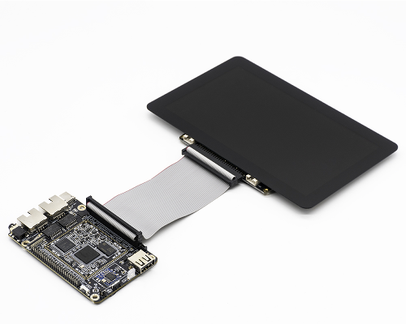

# 实拍：合璧操作系统 HybridOS 运行在 RK3308 开发板上 

飞漫软件开发团队近期完成了合璧操作系统（HybridOS）设备侧在 RK3308 上的移植。

在本次移植中，使用的开发板是瑞芯微公司出品的`ROC-RK3308B-CC-Plus`开发板，其上`CPU`为`rockchip rk3308`。

`ROC-RK3308B-CC-Plus`开发板的主要技术参数为：
   - ARM 四核 64 位 Cortex-A35 内核，主频 1.3GHz
   - 512M DDR3
   - 4GB eMMC
   - 支持 RMII 接口，可扩展 10M/100M bps 以太网
   - 支持 SDIO 3.0，可扩展 2.4GHz/5.0GHz WiFi 和 Bluetooth 4.2/5.0 单/多合一模块
   - 7 寸显示屏，分辨率为 1024 * 600

下面就是这款开发板：

◇◇

## HybridOS 主要技术特点

HybridOS 设备侧 R2011 版本在开发板上，主要使用的软件组件为：

1. MiniGUI 5.0.3，多进程模式，合成图式：
   - 视频中应用的启动条、状态栏、背景动画等，基于合成图式实现。
   - 视频中应用的缩小展示、切换、管理等，使用了 MiniGUI 在合成图式下的定制合成器技术开发。
   - 在瑞芯 PX30 开发板上，使用 DRM 图形引擎；在全志 R818 开发板上使用 FB 图形引擎。
   - 采用的是纯软件渲染效果，暂未启用 GPU。在使用 DRM 图形引擎时，动画流畅顺滑，但在使用 FB 图形引擎时，有丢帧现象。
1. hiShell：用于启动应用、切换应用、管理应用的外壳程序。
1. hiWebKit：用于支撑 HTML5 及 HybridOS 扩展特性的 WebKit 扩展版本：
   - 其中用于展示手表表盘、秒表的页面，采用 hiWebKit 的 `hiview` 扩展标签实现。
   - 其中用于展示仪表盘的页面，使用了 hiWebKit 的 `himeter` 和 `hihand` 扩展标签实现。
   - 仔细观察表盘及仪表盘中的指针及条带变化，在两款开发板上的运行效果都非常棒。

## 编译并烧写 ROC-RK3308B-CC-Plus 开发板

本次所使用的开发板是`ROC-RK3308B-CC-Plus`发板，并带`7`寸屏。屏幕分辨率为`1024 x 600`。所使用的配置文件为`roc-rk3308b-cc-plus_rgb-7.0inch_qt_release_BoardConfig.mk`。

#### 代码的获取

访问`https://www.t-firefly.com/doc/download/73.html`下载`SDK`。下载文件为`Firefly-RK3308_Linux_SDK_git_20190924.7z`。

#### 升级SDK

按下面的命令，安装所需要的软件，并升级`SDK`：

```bash
    $ sudo apt-get install git-core gnupg flex bison gperf build-essential zip curl zlib1g-dev gcc-multilib g++-multilib libc6-dev-i386 lib32ncurses5-dev x11proto-core-dev libx11-dev lib32z1-dev ccache libgl1-mesa-dev libxml2-utils xsltproc unzip device-tree-compiler
    $ sudo apt-get install libfile-which-perl sed make binutils gcc g++ bash patch gzip bzip2 perl tar cpio python unzip rsync file bc libmpc3 git repo texinfo pkg-config cmake tree
    $ sudo apt-get install genext2fs
    $ sudo apt-get install p7zip-full
    $ sudo apt-get install gawk
    $ sudo apt-get install libncurses5-dev

    $ mkdir Firefly-RK3308
    $ cd Firefly-RK3308
    $ 7zr x Firefly-RK3308_Linux_SDK_git_20190924.7z
    $ git reset --hard HEAD
    $ git remote -v
    $ git remote set-url gitlab https://gitlab.com/TeeFirefly/rk3308-linux.git
    $ git pull gitlab firefly:firefly
```

#### 编译Uboot

```bash
    $ ./build.sh roc-rk3308b-cc-plus_rgb-7.0inch_qt_release_BoardConfig.mk
    $ ./build.sh uboot
```

编译完，会生成`trust.img`、`rk3308_loader_xxx.bin`、`uboot.img`三个镜像文件。

#### 编译Kernel

```bash
    $ ./build.sh roc-rk3308b-cc-plus_rgb-7.0inch_qt_release_BoardConfig.mk
    $ ./build.sh kernel
```

最终生成的`kernel.img`和`resource.img`将会被打包进`zboot.img`，更换内核的时候，只需烧写`zboot.img`即可。

#### 编译Buildroot

前面编译的是`uboot`和`kernel`，现在编译一些系统软件，使用`buildroot`。

```bash
    $ source buildroot/build/envsetup.sh        选择firefly_rk3308_release
    $ make -j4
    $ ./mkfirmware.sh
```

所有烧写所需的镜像都将会拷贝于`rockdev`目录。

#### 一键编译

为了简化前面的编译步骤，可以使用瑞芯微提供的一键编译：

```bash
    $ ./build.sh roc-rk3308b-cc-plus_rgb-7.0inch_qt_release_BoardConfig.mk
    $ ./build.sh
```

最终生成`update.img`，放在`rockdev`目录下。

#### 烧写映像文件到开发板

- 准备烧写工具

```bash
    $ cd tools/linux/Linux_Upgrade_Tool/Linux_Upgrade_Tool_v1.38
    $ chmod +x upgrade_tool
    $ sudo mv upgrade_tool /usr/sbin
    $ sudo chown root:root /usr/sbin/upgrade_tool
    $ sudo cp config.ini /usr/sbin
```

- 按住开发板上的`recovery`键不要松手；

- 拔掉`type-c`接口，使得开发板掉电；

- 插上`type-c`接口，使得开发板重新上电；

- 松开`recovery`键；

- 在`PC`机上输入下面的命令：

```bash
    $ cd rockdev
    $ sudo upgrade_tool uf update.img
```

## 编译 HybridOS 操作系统

#### 代码的获取

使用下面的命令，获得`HybridOS`代码：

```bash
    $ git https://gitlab.fmsoft.cn/hybridos/build-hybridos-rootfs.git
    $ cd build-hybridos-rootfs
```

在编译的过程中，将会下载大量的代码。由于网络状况的不同，经常会发生下载失败的可能。因此我们将所需下载的软件打包，这样可以免去因网络原因导致的编译失败。下载地址为：

<https://hybridos.fmsoft.cn/downloads/rk3308/buildroot-dl.tar.gz>

下载完毕后，将软件移至`build-hybridos-rootfs`目录中，然后：

```bash
    $ tar zxf buildroot-dl.tar.gz
    $ mv buildroot-dl dl
```

#### 代码的编译

使用下面的命令，编译`HybridOS`：

```bash
    $ source build/envsetup.sh
    $ lunch             选择: 10. rk3308_hybridos
    $ make -j4
```

生成的文件，在`output/target`目录下。

## 在开发板上运行 HybridOS

- 将`output/target`目录，传送到开发板的`/userdata`目录下：

```bash
    $ cd output
    $ adb push target /userdata
```

- 使用`adb shell`登录开发板：

```bash
    $ adb shell
```

- 在开发板上进行如下操作：

```bash
    // 添加环境变量
    # vi /etc/profile
        export LD_LIBRARY_PATH=/userdata/target/usr/lib:/userdata/target/lib:$LD_LIBRARY_PATH
        export MG_RUNTIME_TMPDIR=/tmp

    // 修改启动脚本
    # cd /etc/init.d/
    # mv S50launcher ../

    // 设置字体
    # cd /usr/share
    # ln -s /userdata/target/usr/share/mime mime
    # ln -s /userdata/target/usr/share/fonts fonts
    # cd fonts
    # /userdata/target/usr/bin/fc-list

    // 添加链接
    # cd /usr/libexec
    # ln -s /userdata/target/usr/libexec/samples samples
    # ln -s /userdata/target/usr/libexec/webkit2hbd-1.0/ webkit2hbd-1.0
    # cd /usr/local
    # mkdir share
    # cd share
    # ln -s /userdata/target/usr/share/minigui/ minigui
    # cd /usr/local/share/minigui/res/
    # ln -s /userdata/target/usr/share/fonts/ font

    // 添加驱动
    # cd /userdata/target/usr/lib
    # cp -fra gio /usr/lib

    // 修改MiniGUI.conf
    # cd /userdata/target/libexec
    # vi MiniGUI.conf
        [system]
        gal_engine=drm
        defaultmode=1024x600-32bpp

        ial_engine=singletouchkey
        mdev=/dev/input/mice
        mtype=IMPS2

        [singletouchkey]
        touch_dev=/dev/input/event0

        [cursorinfo]
        cursorpath=/userdata/target/usr/share/minigui/res/cursor/
        cursornumber=0

        [resinfo]
        respath=/userdata/target/usr/share/minigui/res/

        [truetypefonts]
        font_number=1
        name0=ttf-Source Sans Pro,SansSerif-rrncnn-0-0-ISO8859-1,UTF-8
        fontfile0=/usr/local/share/minigui/res/font/sans-serif-hei-chinese-medium.ttf

    // 修改wifi参数
    # cd /userdata/target/libexec
    # vi hybridos.cfg
        [wifi_test]
        ssid=your_wifi_ssid
        password=your_wifi_password

    // 添加插件库
    # cd /opt
    # ln -sf /userdata/target/opt/view-renderers view-renderers

    // 重新启动
    # sync
    # reboot
```

此时就可以看到`HybridOS`运行界面了。

注意：如果想要对`HybridOS`进行调试，通过`adb shll`登录系统，则需要运行下面的命令：

```bash
export LD_LIBRARY_PATH=/userdata/target/usr/lib:/userdata/target/lib:$LD_LIBRARY_PATH
export MG_RUNTIME_TMPDIR=/tmp
```

## 下载映像文件运行 HybridOS

前面的步骤较为繁琐，为了能让用户更快的体验到`HybridOS`，我们提供了映像文件。

- 下载映像文件和文件系统，下载地址为：
   - <https://hybridos.fmsoft.cn/downloads/rk3308/update.img>
   - <https://hybridos.fmsoft.cn/downloads/rk3308/target.tar.gz>

- 首先按照前面的烧写步骤说明，烧写开发板：

```bash
    $ sudo upgrade_tool uf update.img
```
- 然后解压缩`target.tar.gz`，并将目录传送到开发板，并登录开发板：

```bash
    $ tar zxf target.tar.gz
    $ adb push target /userdata
    $ adb shell
```

- 在开发板上进行重新配置：

```bash
    # cd /userdata/target
    # ./setup
```

开发板将自动进行配置，并且重新启动。重新启动后，既可看见`HybridOS`界面。


## 后续计划

飞漫的研发团队正在快马加鞭的将合璧操作系统设备侧的完全版本(HybridOS)移植到 D1 开发板上。届时将完成 HybridOS 对 RISC-V 体系架构的完全支持。

喜欢我们的朋友不会等待太久。

**支持合璧操作系统，请点亮 GitHub 上 HybridOS 项目的星星吧：**

<https://github.com/FMSoftCN/hybridos>

---
