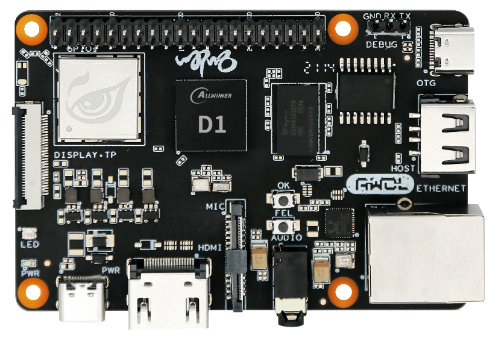

# 实拍：合璧操作系统 HybridOS Lite 运行在 RISC-V 开发板上

飞漫软件开发团队近期完成了合璧操作系统（HybridOS Lite）设备侧在 RISC-V 上的移植。

RISC-V 是一个基于精简指令集（RISC）的开源指令集架构（ISA），其可以免费用于所有希望的设备中，允许任何人设计、制造和销售 RISC-V 芯片和软件。

在本次移植中，使用的开发板是珠海全志科技股份有限公司出品的 D1-nezha 开发板，其上为全球首颗搭载平头哥玄铁 C906 RISC-V 的应用处理器 D1。

全志 D1 芯片的主要技术参数为：
   - XuanTie C906 RISC-V CPU
   - 32 KB I-cache + 32 KB D-cache
   - DDR2/DDR3, up to 2 GB
   - SD3.0/eMMC 5.0, SPI Nor/Nand Flash
   - USB2.0 OTG, USB2.0 Host、SDIO 3.0、10/100/1000M EMAC with RMII and RGMII interfaces

下面就是这款风风火火的小哪吒：

  

## HybridOS Lite 主要技术特点

1. 多进程模式,解耦模块：

   在 HybrdiOS Lite 的架构中，MiniGUI 扮演了重要的角色。 MiniGUI 的多进程运行模式，为模块解耦提供了技术支撑。 MiniGUI 5.0 的合成图式(compositing schema)，则是创建酷炫界面和交互能力的一大利器。开发者通过修改默认合成器(compositor)一些方法，或者创建定制的合成器，就能够灵活地控制窗口的位置、大小、层叠关系，进而在应用、屏幕等切换时,实现动画效果。最终在嵌入式系统资源有限的情况下，可以获得不亚于桌面系统的用户交互体验；

1. 数据驱动：

    数据驱动，是 HybridOS 的核心思想之一。功能解耦,界面与数据逻辑分离后，hiBus 总线负责将所有模块连接起来，使之成为一个有机的整体。与传统的消息驱动机制相比，hiBus 总线做了几点重要改进：使用 JSON 格式封装数据，增强数据传输的灵活性；提供不同进程之间的事件订阅与远程调用，hiBus 总线不但是数据传输的通道，还是逻辑功能的载体；提供跨平台的网络接口，打通不同设备之间、本机业务与云服务之间的壁垒；

1. 模块重组易如反掌：

   在 HybridOS Lite 的编程思想中，功能解耦后形成若干功能模块。类似组态软件，用户可对功能模块其进行任意组合。功能模块如何组合，如何显示则由布局文件 manifest.json 决定。在诸如工业控制面板、家用电器、智能门锁、智能音箱等产品中，多以屏为单位组织应用。因此 HybridOS Lite 使用了这样的应用组织方式。在布局文件中，指定了每屏所包含的应用、各个应用的位置、应用之间的通信关系等。同时提供了动态切换布局的机制，使得同一产品能轻易展示出不同的系统样貌。

1. 使用 CSS ,应用界面随意调整：

   传统编程方式中，界面元素的调整，无外乎两种方式：第一,修改代码、重新编译；第二，写一个私有的配置文件，指定界面元素的属性。但是这两种方式，在 HybridOS Lite 中得到了彻底改变。 HybridOS Lite 借鉴了 Web 前端开发中的 CSS 规范，利用其指定界面元素的诸多属性。由于有CSS 规范可循，任一了解 CSS 规范的开发者，都可以在不了解渲染逻辑的情况下，通过修改 CSS 文件对界面元素进行修改，而非修改源代码。有规可循，极大地提高了代码迭代速度，降低了代码维护难度，也降低了对开发者的要求；

1. 小体积,大能力：

   整体上， HybridOS Lite 可在拥有64MB Flash 和 64MB RAM (或更低)的系统中运行。


## 在哪吒开发板上的移植方法

### 编译并烧写哪吒开发板

1) 访问：<https://open.allwinnertech.com>，注册用户。这里假设用户注册名为： your_name；

2) 下载 SDK： 请按照：<https://open.allwinnertech.com/#/sdk/264?menuID=36&projectName=D1_Tina_Open&chipId=246> 中的步骤完成操作；

3) 安装 repo：

```bash
    $ git clone ssh://your_name@sdk.allwinnertech.com/git_repo/repo.git
        修改repo/repo: REPO_URL='ssh://your_name@sdk.allwinnertech.com/git_repo/repo.git'
    $ sudo cp repo/repo /usr/bin/repo
    $ sudo chmod 777 /usr/bin/repo
```

4) 下载并同步源代码：

```bash
    $ mkdir tina-d1-open
    $ cd tina-d1-open
    $ repo init -u ssh://your_name@sdk.allwinnertech.com/git_repo/D1_Tina_Open/manifest.git -b master -m tina-d1-open.xml
    $ repo sync
    $ repo start product-smartx-d1-tina-v1.0-release --all
```

5) 修改内核配置，支持鼠标设备：

```bash
    $ make kernel_menuconfig
        Input device support  --->
        Polled input device skeleton    选中
        Mouse interface                 选中
        Mice  --->
            为简便起见，全部选中
    $ make -j4
    $ pack
```

6) 如果显示输出为 HDMI，则需修改内核，并将 FrameBuffer 大小调整到与显示输出一致：

修改 device/config/chips/d1/configs/nezha/uboot-board.dts 中代码为以下部分：

```bash
        dev0_output_type         = <4>;
        dev0_output_mode         = <10>;
        dev0_screen_id           = <0>;
        dev0_do_hpd              = <1>;

        dev1_output_type         = <1>;
        dev1_output_mode         = <4>;
        dev1_screen_id           = <1>;
        dev1_do_hpd              = <0>;
```


7) 编译和打包：

```bash
    $ source build/envsetup.sh
    $ lunch
        选择 2: d1_nezha-tina
    $ make -j4
    $ pack
```

8) 烧写开发板，参考文档：

<https://d1.docs.aw-ol.com/study/study_4compile/>

### 移植 HybridOS-lite

1) 下载 cross_compile 目录：

```bash
    $ cd tina-d1-open
    $ wget https://hybridos.fmsoft.cn/downloads/d1-riscv/cross_compile.tar.gz
    $ tar zxf cross_compile.tar.gz
    $ rm -f cross_compile.tar.gz
```

2) 交叉编译 HybridOS-Lite：

```bash
    $ cd cross_compile
    $ ./prepare.sh
    $ ./cross_compile
```

因为各个机器环境差异，有可能编译不成功。则需要根据错误信息，安装相关软件包或者修改源头代码。

注意：在整个交叉编译过程中，prepare.sh 脚本只需要执行一次即可。

### 在开发板上运行 HybridOS-lite

1) 将编译目录下的 /usr 目录压缩，传送到开发板的 /root 目录下：

```bash
    $ cd Output/HBD/Root
    $ tar zcf usr.tar.gz usr/
    $ adb push usr.tar.gz /root
```

2) 将编译目录下的 Source/hybridos-lite/bin 目录传送到开发板的 /root 目录下：

```bash
    $ cd Source/hybridos-lite
    $ adb push bin /root/
```

3) adb shell 登录开发板：

```bash
    $ adb shell
```

4、在开发板上进行如下操作：

```bash
    $ cd /root
    $ tar zxf usr.tar.gz
    $ vim /etc/profile，添加
        export LD_LIBRARY_PATH=/root/usr/lib:$LD_LIBRARY_PATH
    $ cp /root/usr/sbin/hibusd /root/bin
    $ mkdir -p /usr/local/share
    $ ln -s /root/usr/share/minigui/ /usr/local/share/minigui
    $ mkdir -p /usr/share/fonts
    $ cp /root/usr/share/minigui/res/font/* /usr/share/fonts/
    $ /root/usr/bin/fc-list

    $ cd /root/bin
    $ vim MiniGUI.cfg
        [system]
        # GAL engine and default options
        # The equivalent environment variable: MG_GAL_ENGINE
        gal_engine=fbcon
        # The equivalent environment variable: MG_DEFAULTMODE
        defaultmode=800x450-32bpp

        # IAL engine
        # The equivalent environment variable: MG_IAL_ENGINE
        ial_engine=console
        mdev=/dev/input/mouse0
        mtype=IMPS2

        [fbcon]
        defaultmode=800x450-32bpp

        [cursorinfo]
        # Edit following line to specify cursor files path
        cursorpath=/usr/local/share/minigui/res/cursor/
        cursornumber=1

    $ cd /root/bin/layout
    $ cp default_layout.css default.css
    $ cd ..
    $ ./hibusd -d
    $ ./mginit
```

### 使用映像文件运行 HybridOS Lite

为使用户能够更快的看到 HybridOS Lite 实际使用效果,特提供了相关的开发板映像文件,以及相关文件系统。

1) 下载映像文件和文件系统，下载地址为：

<https://hybridos.fmsoft.cn/downloads/d1-riscv/tina_d1-nezha_uart0.img>

<https://hybridos.fmsoft.cn/downloads/d1-riscv/root.tar.gz>

2) 使用 tina_d1-nezha_uart0.img 烧写开发板,参考文档:

<https://d1.docs.aw-ol.com/study/study_4compile/>

3) 将 root.tar.gz 传送到开发板的 / 目录下:

```bash
$ adb push root.tar.gz /
```

4) adb shell 登录开发板:

```bash
$ adb shell
```

5) 在开发板上进行如下操作:

```bash
$ cd /
$ tar zxf root.tar.gz
$ vim /etc/profile
    添加
    export LD_LIBRARY_PATH=/root/usr/lib:$LD_LIBRARY_PATH
$ mkdir -p /usr/local/share
$ ln -s /root/usr/share/minigui/ /usr/local/share/minigui
$ mkdir -p /usr/share/fonts
$ cp /root/usr/share/minigui/res/font/* /usr/share/fonts/
$ /root/usr/bin/fc-list

    重新启动开发板,使配置生效。然后在 PC 机上运行命令
    $ adb shell

    登录开发板，在开发板上输入:
$ cd /root/bin
$ ./hibusd -d
$ ./mginit
```

## 后续计划

飞漫的研发团队正在快马加鞭的将合璧操作系统设备侧的完全版本(HybridOS)移植到 D1 开发板上。届时将完成 HybridOS 对 RISC-V 体系架构的完全支持。

喜欢我们的朋友不会等待太久。

**支持合璧操作系统，请点亮 GitHub 上 HybridOS 项目的星星吧：**

<https://github.com/FMSoftCN/hybridos>

---
